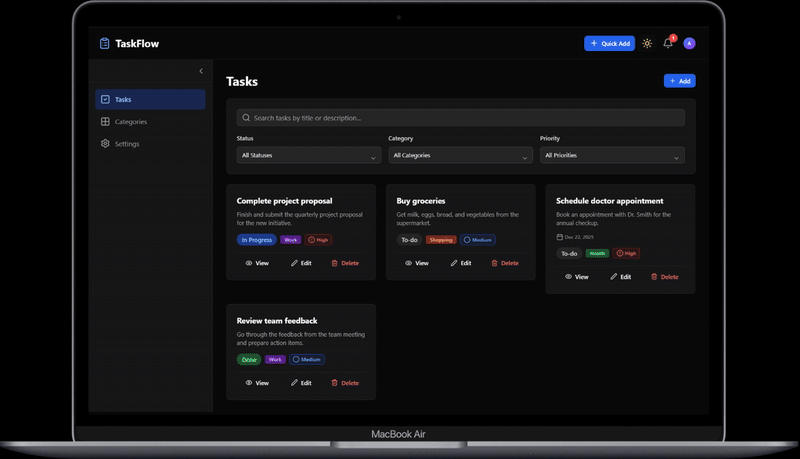

# TaskFlow

A modern, feature-rich task management application built with React, TypeScript, and Tailwind CSS. Organize your tasks efficiently with categories, status tracking, and a beautiful dark mode.

## Features

- ✅ **Create, Read, Update, Delete Tasks** - Full CRUD functionality
- 📂 **Category Management** - Organize tasks by custom categories
- 🏷️ **Status Tracking** - Track task progress (Todo, In Progress, Done)
- 🔍 **Search & Filter** - Find tasks quickly by title or category
- 🌙 **Dark/Light Mode** - Switch themes seamlessly
- ✨ **Smooth Animations** - Delightful UI with framer-motion
- 📱 **Responsive Design** - Works on desktop, tablet, and mobile
- 💾 **Local Storage** - Tasks persist across sessions
- ♿ **Accessible** - Built with accessibility best practices

## Tech Stack

- **Frontend**: React 19.2.0 with TypeScript 5.9.3
- **Build Tool**: Vite 7.2.2
- **Styling**: Tailwind CSS 3.4.18
- **Animations**: Framer Motion 7.x
- **Icons**: Lucide React
- **State Management**: React Context API + Custom Hooks
- **Storage**: LocalStorage API

## Getting Started

### Prerequisites
- Node.js 18+
- npm or yarn

### Installation

```bash
# Clone the repository
git clone https://github.com/vonB22/Task-Management-App.git
cd Task-Management-App

# Install dependencies
npm install

# Start development server
npm run dev

# Build for production
npm run build
```

The app will be available at `http://localhost:5173`

## Project Structure

```
src/
├── components/       # Reusable UI components
├── pages/           # Page components
├── context/         # React Context (Theme, etc.)
├── hooks/           # Custom hooks (useTasks, useLocalStorage, etc.)
├── lib/             # Utilities and animations
├── types/           # TypeScript type definitions
└── assets/          # Static assets
```

## Demo

<p align="center">
  
</p>

## Key Components

- **TaskCard** - Individual task display with actions
- **Modal** - Dialog for adding and editing tasks
- **Sidebar** - Navigation with smooth animations
- **FilterSection** - Search and filter controls
- **Navbar** - Top navigation with theme toggle

## Performance

- React.memo optimization throughout
- Memoized callbacks with useCallback
- Computed values with useMemo
- Efficient re-render strategy

## Deployment

The project is configured for Vercel deployment. Push to GitHub and connect your repository to Vercel for automatic deployments.

## License

MIT License - feel free to use this project for personal or commercial purposes.